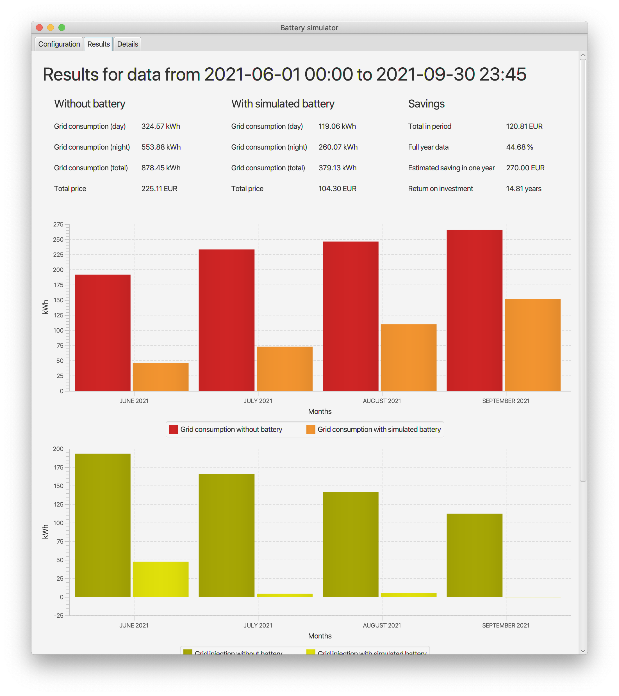
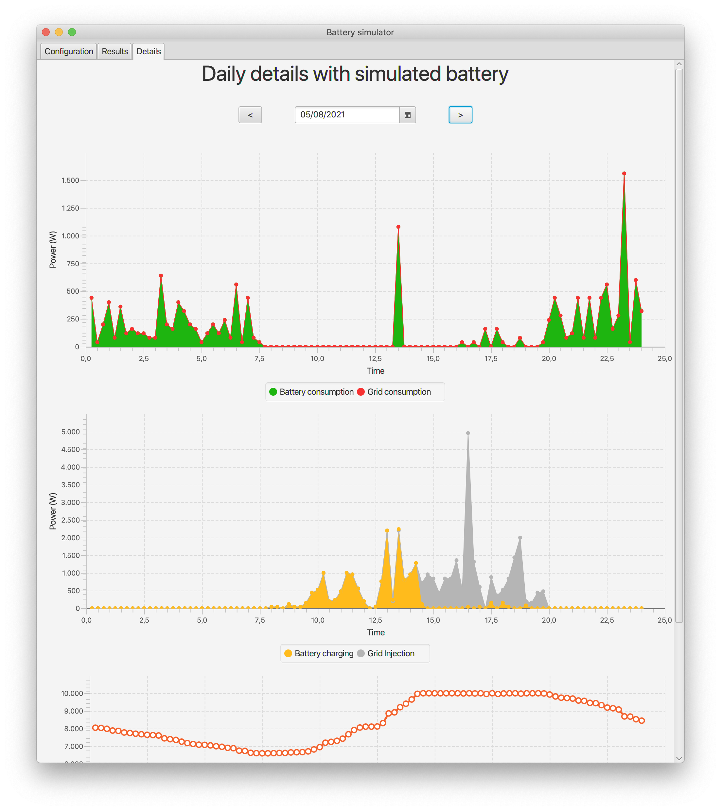

# Home battery simulator [work in progress]

## Introduction

Calculate the return-on-investment of a home battery system, given historical grid consumption and injection values from a digital meter.

Please note this application currently only works with log files from Fluvius, an electricity network operator in parts of Belgium. Use logs files with 15-minute data for the best results.
**TODO**: add detailed instructions on how to download such logs.

If you have other types of logs files, have a look at [How to extend for other log file formats](#how-to-extend-for-other-log-file-formats).

## How to use

### Install

First of all, you need to run the application on your PC. There are several options:

- Download one of the installers for [Windows](releases/download/v1.0.0/BatterySim-windows-1.0.0.msi), [Mac OS](releases/download/v1.0.0/BatterySim-macos-1.0.0.pkg) or Linux ([deb](releases/download/v1.0.0/BatterySim-linux-1.0.0.deb) or [rpm](releases/download/v1.0.0/BatterySim-linux-1.0.0.rpm)) from the [release page](releases/tag/v1.0.0).
- Or download the source code and run the application from source. See [How to run in development](#how-to-run-in-development) below.

### Run

- Once started, you will see the application config screen
- Click `Select csv...` and find your historical usage log file. 
- If you don't have such a log file, you can [download a sample here](sample-data).
- Adjust the config params to your situation: battery size, battery price, electricity prices, ...
- Push the `Calculate` button
- This will process the log file, simulate the use of a home battery and show the results in the `Results` tab. The `Details` tab contains a daily graph of the simulated battery usage.
- You can go back to the `Config` tab, adjust the parameters and calculate again.





## How to run in development

### Prerequisites
- [Java 17](https://jdk.java.net/17/)
- [Apache Maven](https://maven.apache.org/download.cgi)
- Optionally an IDE. The following instruction will use command-line instructions, so you don't need an IDE to run.

If you're new to Java or JavaFX, please have a look at [openjfx.io](https://openjfx.io/openjfx-docs/) for more information.

### Steps to run

- Download or clone this git repository
- Open a terminal window and change dir to the source code
```
cd batterysim
```
- Use Maven to run the application

```
mvn javafx:run
```

- Continue with the steps described in [How to use - Run](#run)


## How to extend for other log file formats

**TODO**
